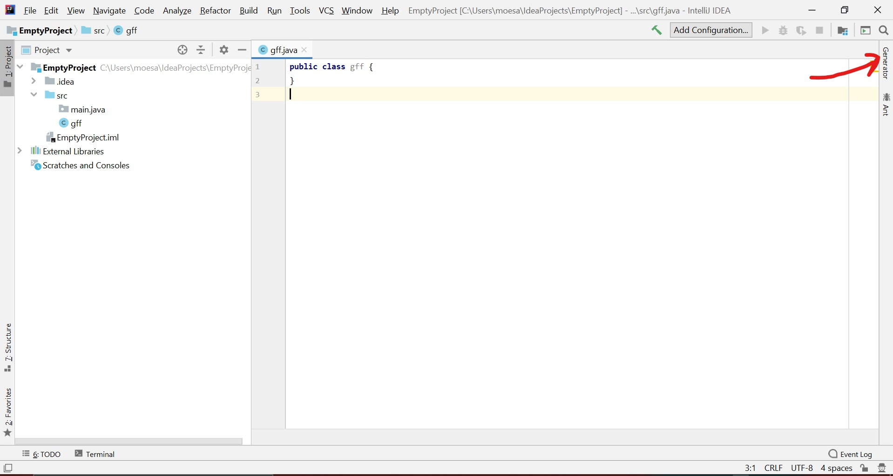
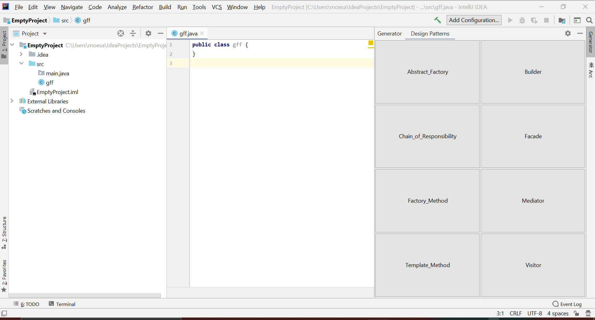

# Documentation

## By: Mohamed Saeed
This program is a design pattern generator plugin where a user executing this program will choose one of the 8 listed 
design patterns to generate.
Based on the specified design patterns, the user will be prompted additional information via popups about those 
design patterns. These additional information may consist of: name of design pattern class, list of design pattern 
methods, name of interface for similar classes, list of similar classes, list of methods that belong to those classes.

## New Feature
The newest feature consists of name clash detection. User will be prompted to re-enter another name if the program 
detects name clash, meaning that the class name already exists. Name clash detection will be based on the directory the
user is trying to save the generated files to.

## How the Program is written

This Program is divided into multiple directories and classes based on the task they are to complete.

All the design patterns inherits from the abstract class Pattern. This allows in the reduction of the amount of code 
written, and makes it easier for modification to occur.

Each design pattern generation class (such as AbstractFactory, Builder, Chain of Responsibility, Facade, 
Factory Method, Mediator, Template Method, and Visitor) contains specific functions in building that specific
design pattern and it also contains information on how the design pattern is generated.

The CustomInput package within the generate package, contains all the different customized inputs, making it easier to 
find and update if need be. MainContent class retrieves all the files in the directory before a design pattern is 
specified, this allows us to detect if a file is deleted in the process, so that its not clashed with future class names.

DesignFactory interface allows us to make a contract for creating different instances of Patterns, which is then 
implemented in the Factory class. This allows for the abstraction of the creation of instances of type Pattern.

The Generator class is the middle man between the user and the subsystem that we have here, which makes it easier for 
users to be able to use the program. The class creates an instance of the desired design pattern to be generated. It
delegates the generation of the pattern to the Composite class, which will call the generate method.

DesignGen is the code behind creating the plugin ToolWindow and setting it up.

Lastly, ClashDetect class assists in detecting whether a specified file name already exists in that directory. 
It uses static variables to help with keeping the consistency of the variables throughout the program.

## Implemented Design Patterns

The three design patterns implemented in this application are:

 * Abstract Factory (This implementation is sought in DesignFactory.java and implemented in Factory.java.)
 * Facade (This implementation is seen in Generator.java.)
 * Composite (This implementation is viewed in Composite.java.)
 
Abstract Factory is used to instantiate similar objects of type Pattern, these Pattern types include classes that are 
used to generate the different design patterns(e.g. Facade, Visitor).
I used this because it allows me to generate instances of similar objects with only one function call.

Facade was used to make it easier for the user/client to generate templates for the different design pattern. 
The user, rather than instantiating and calling each design pattern generator class individually, only calls a method 
to generate their desired design pattern template, leaving out the concrete implementation on how they're being generated.
 
### Pros

The pros of having different files for each java class is that it becomes easier and faster to locate specific code to 
modify or add. It also allows for decoupling of different components and making it able to reuse some of the code.

##### Abstract Factory

This allows for the instantiation of similar objects(Inheritance), without really bothering the user/client with how 
the object was instantiated. 
The Pro is that the user doesn't need to know how the object is instantiated but rather that they will receive the 
correct instance of the object.

##### Facade

The Pro is that it reduces direct dependency between Client and multiple objects, by allowing the Client to communicate
 with a "middle man" or the Facade. 

##### Composite

Pro is that it allows for the execution of multiple similar objects, rather than calling the same method of each 
object individually.

### Cons

The overall cons about having separate java files is that the files become scattered, meaning that they are not in one
place.

##### Abstract Factory

When adding/expanding the groups someone would have to go back and expand the Abstract Factory.

In other words, if we want to add "Square" to the grouping of "Shape", someone would need to create a condition that 
would look for key word to instantiate "Square".

##### Facade

There aren't any disadvantages or consequences in using Facade, but I can see that it might confuse the client if it 
was used inappropriately.

##### Composite

For me this can be a disadvantage because it limits the freedom of the method call, meaning each object would need to 
call the same method with the same parameters; therefore, making it hard to customize the parameters given to a function.

An example would be running similar objects that would require different parameters. Running Shape.draw("dashed") and 
Shape.draw("solid") would be difficult to execute when using composite. 

## Limitations

Here is a list of limitations this program has:

 * Generation of parameters of methods are not allowed.
 * When listing multiple classes or methods users are advised to separate the different classes/methods by spaces and 
 nothing else.
 * Users are restricted in giving only 1 interface when specified, the only exception is when specifying for an Abstract
  Factory then the user is allowed to specify more than 1 interface, space separated.
 * User should fill in at least 1 thing when prompted for additional information(i.e "Name of Interface", "List of 
 classes", etc.), failure to do so will result in an additional pop-up to notify the user to fill out the missing 
 information.

## Design Pattern Naming Convention

Here is a list of buttons a user can click on:

 * Abstract_Factory (This would initiate the process of creating an Abstract Factory)
 * Builder (This would initiate the process of creating an Builder)
 * Chain_of_Responsibility (This would initiate the process of creating an Chain of Responsibility)
 * Facade (This would initiate the process of creating an Facade)
 * Factory_Method (This would initiate the process of creating an Factory Method)
 * Mediator (This would initiate the process of creating an Mediator)
 * Template_Method (This would initiate the process of creating an Template Method)
 * Visitor (This would initiate the process of creating an Visitor)

## Installation and Execution

To download this program from bit-bucket, run this command in a git friendly command prompt:

`git clone https://MohamedSaeed99@bitbucket.org/MohamedSaeed99/mohamed_saeed_hw2.git` 

###### Using Intellij

Open the downloaded project in intellij and run it.

###### Using CommandLine

 1. Download and install Gradle, and make sure that you are able to use gradle via command line.

 2. Navigate to the project.

 3. Run `./gradlew build` to build the project.
 
 4. Run `./gradlew runIde` this will begin the execution of the program. 

## Plugin
After executing the program a new intellij window should appear asking user to open or create existing project.
After a project is opened/created the user should be able to see a Generator tool pinned to the right of the window. 

When a user wants to create a design pattern they simply have to click on the pinned Generator tool.

Then the user can simply click one of the displayed design patterns, after doing so they will be prompted to insert 
additional information relating to chosen design pattern via popup windows.

## Results

After a user decided on a design pattern and inserted all the information asked for, the design pattern class along with
other complementary classes will be saved in the users current directory within the specified path and package found 
in the configuration file(application.conf). If for some reason the program fails to retrieve the path and package from
the configuration file then it defaults to the location `"/src/main/java"` in package `GeneratedCode`.

## Logger Location
The log file will be located in `C:\logs\app.log` which is the home directory of the user.